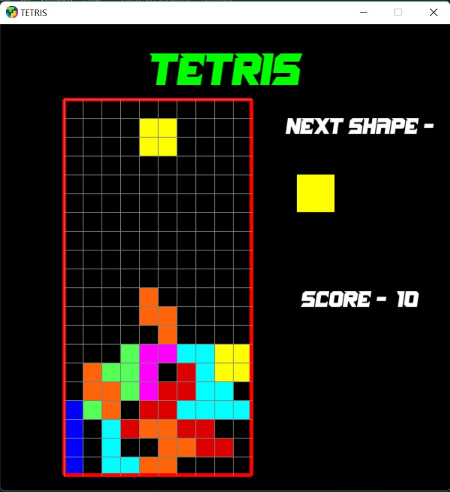

# TETRIS
### Overview
Herein I have built the famous Tetris game completely on Python using pygame library.

### How To Play
The game is played only on the 4 direction keys on the keyboard. The left and right direction key move the falling piece 
left and right. The bottom direction keys move the piece faster below. What the upper direction keys does is that it 
changes the orientation of the piece i.e. it rotates the falling piece by 90 degrees.

### Screenshots

### Requirements
The required modules are mentioned in requirements.txt
